# Stanford Background Dataset 语义分割实验报告

## 1. 实验概述

本实验面向 Stanford Background Dataset 的像素级语义分割任务，从零实现经典 U-Net 网络，并比较三种损失函数配置对模型性能的影响：

1. Cross-Entropy Loss
2. Dice Loss
3. Cross-Entropy Loss + Dice Loss

实验目标是训练一个能够对自然场景图像进行逐像素分类的分割模型，并从训练曲线、验证集指标和测试集指标三个角度比较不同损失函数的表现。最终交付内容包括完整代码、实验报告和三组最佳模型权重。

## 2. 数据集介绍

本项目使用 Stanford Background Dataset。数据集中每张图像都配有像素级区域标注文件，适合用于语义分割模型训练与评估。

本实验使用 8 个语义类别：

| 类别编号 | 类别名称              |
| ----:| ----------------- |
| 0    | sky               |
| 1    | tree              |
| 2    | road              |
| 3    | grass             |
| 4    | water             |
| 5    | building          |
| 6    | mountain          |
| 7    | foreground_object |

数据读取阶段会将无效标签、负数标签或越界标签映射为 `ignore_index=255`。这些像素不会参与损失计算和评价指标统计，从而避免 unknown 区域干扰模型训练。

### 2.1 数据划分

本实验共发现 715 个可配对样本，按照固定随机种子 `42` 划分为训练集、验证集和测试集：

| 数据集 | 比例  | 样本数 | batch size=8 时 iteration 数 |
| --- | ---:| ---:| --------------------------:|
| 训练集 | 70% | 500 | 63                         |
| 验证集 | 15% | 107 | 14                         |
| 测试集 | 15% | 108 | 14                         |

图像在训练和评估时统一缩放到 `240 x 320`。

## 3. 模型结构

本实验实现的是经典 U-Net 结构，输入为 RGB 图像，输出为 8 类语义分割 logits。

### 3.1 整体结构

模型由编码器、瓶颈层、解码器和输出分类层组成：

- 输入通道数：`3`
- 输出类别数：`8`
- 基础通道数：`32`
- 下采样层数：`4`
- 上采样层数：`4`
- 输出层：`1 x 1 Conv2d`

### 3.2 编码器

编码器每一层使用：

- `MaxPool2d(2)` 下采样
- 两个 `3 x 3 Conv2d`
- 每个卷积后接 `BatchNorm2d`
- 每个 BatchNorm 后接 `ReLU`

通道变化如下：

```text
3 -> 32 -> 64 -> 128 -> 256 -> 512
```

### 3.3 解码器与 skip connection

解码器使用 `ConvTranspose2d` 进行 2 倍上采样，并与编码器同尺度特征进行拼接。拼接后继续通过双卷积块提取特征。

通道变化如下：

```text
512 -> 256 -> 128 -> 64 -> 32 -> 8
```

skip connection 可以保留编码器中的空间细节，有助于恢复边界和小目标区域。

## 4. 实验设置

### 4.1 训练配置

三组实验共享相同的数据划分、网络结构和优化器，仅损失函数不同。

| 项目                    | 设置               |
| --------------------- | ---------------- |
| 网络结构                  | U-Net            |
| 输入尺寸                  | `240 x 320`      |
| 类别数                   | `8`              |
| batch size            | `8`              |
| epoch                 | `40`             |
| 每个 epoch 训练 iteration | `63`             |
| 每个 epoch 验证 iteration | `14`             |
| learning rate         | `0.001`          |
| optimizer             | Adam             |
| weight decay          | `0.0001`         |
| device                | `auto`，优先使用 CUDA |
| AMP                   | 开启               |
| random seed           | `42`             |
| ignore index          | `255`            |

### 4.2 损失函数

三组实验的损失函数配置如下：

| 实验名            | 配置文件                        | loss function        | CE 权重 | Dice 权重 |
| -------------- | --------------------------- | -------------------- | -----:| -------:|
| `unet_ce`      | `configs/unet_ce.yaml`      | Cross-Entropy        | 1.0   | 0.0     |
| `unet_dice`    | `configs/unet_dice.yaml`    | Dice Loss            | 0.0   | 1.0     |
| `unet_ce_dice` | `configs/unet_ce_dice.yaml` | Cross-Entropy + Dice | 1.0   | 1.0     |

Dice Loss 使用多类别 softmax 概率与 one-hot 标签计算类别级 Dice 系数，并忽略 `ignore_index=255` 的像素。

### 4.3 评价指标

本实验使用语义分割常用指标：

- Pixel Accuracy：所有有效像素中预测正确的比例。
- per-class IoU：每个类别的交并比。
- mean IoU，简称 mIoU：所有类别 IoU 的平均值。

说明：mAP 常用于目标检测任务；本项目是语义分割任务，因此使用 mIoU 作为主要评价指标，而不是 mAP。

### 4.4 运行方式

普通 Linux 训练命令：

```bash
.venv/bin/python src/train.py --config configs/unet_ce.yaml
.venv/bin/python src/train.py --config configs/unet_dice.yaml
.venv/bin/python src/train.py --config configs/unet_ce_dice.yaml
```

Slurm GPU 训练命令：

```bash
sbatch scripts/train_unet_slurm.sh
```

普通 Linux 测试和报告生成命令：

```bash
.venv/bin/python src/evaluate.py --config configs/unet_ce.yaml --checkpoint checkpoints/unet_ce_best.pt
.venv/bin/python src/evaluate.py --config configs/unet_dice.yaml --checkpoint checkpoints/unet_dice_best.pt
.venv/bin/python src/evaluate.py --config configs/unet_ce_dice.yaml --checkpoint checkpoints/unet_ce_dice_best.pt
.venv/bin/python scripts/make_report.py --results runs --output reports/experiment_report.pdf
```

Slurm CPU 后处理命令：

```bash
sbatch scripts/evaluate_report_cpu_slurm.sh
```

## 5. SwanLab / 训练过程可视化截图

训练脚本支持 SwanLab 记录实验过程，同时项目会把同一批训练日志保存为本地 CSV 和曲线图。以下图片为本次实验保存下来的训练过程可视化结果，可用于报告归档。每张 loss 图包含训练集 loss 和验证集 loss；Accuracy 图包含训练集与验证集 Pixel Accuracy；mIoU 图展示训练集与验证集 mIoU。

### 5.1 Cross-Entropy

Loss 曲线：

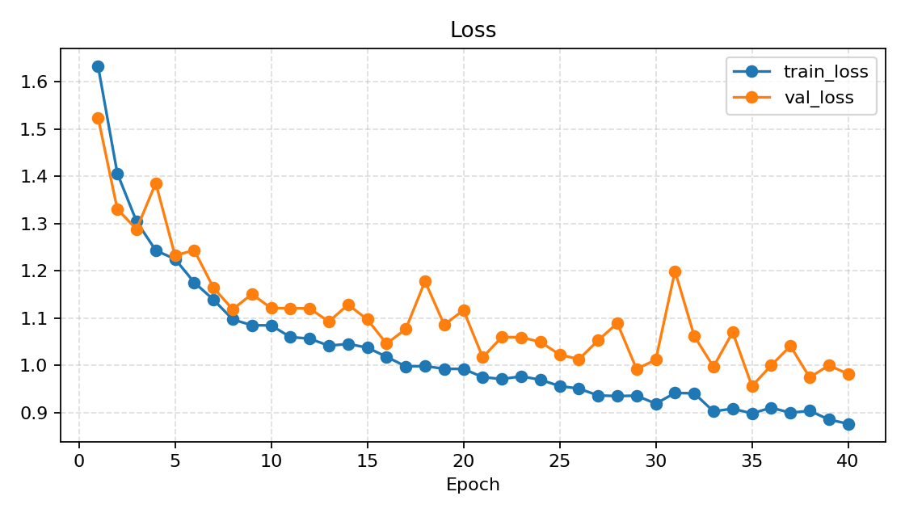

Accuracy 曲线：

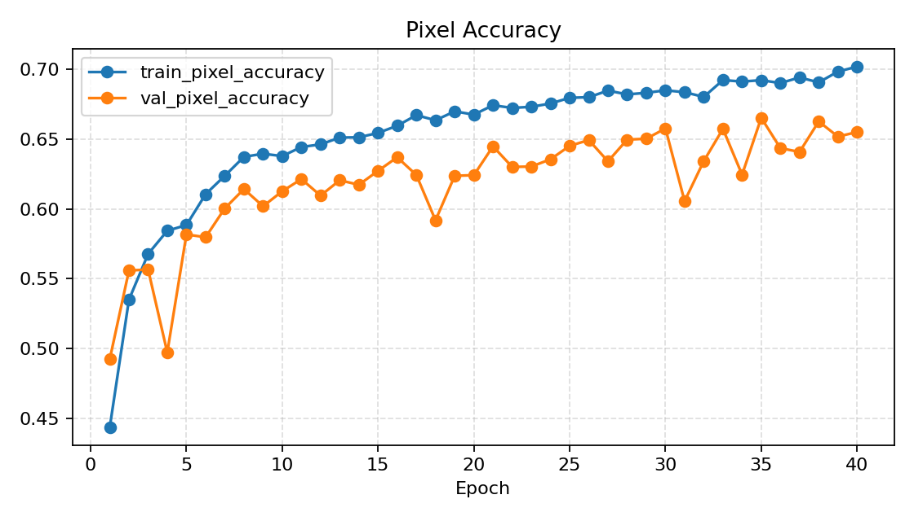

mIoU 曲线：

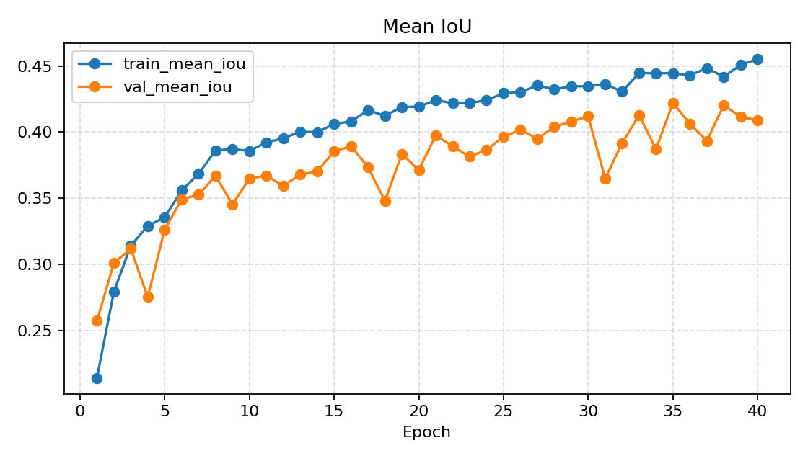

### 5.2 Dice Loss

Loss 曲线：

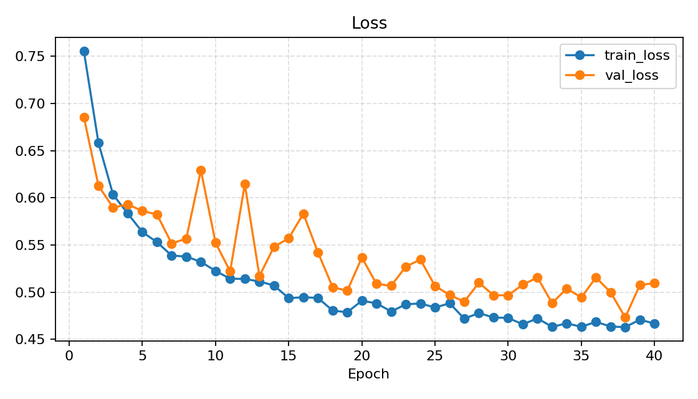

Accuracy 曲线：

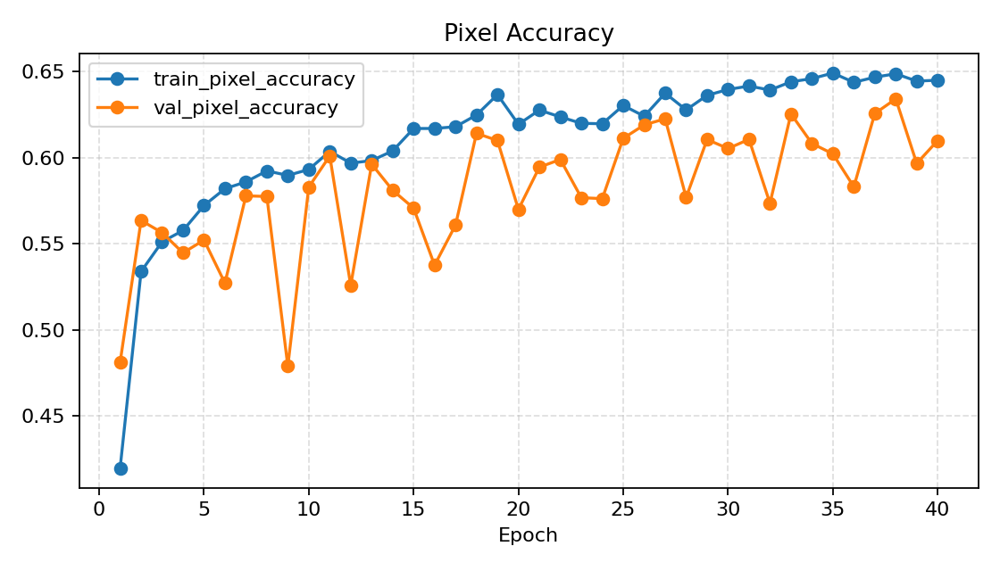

mIoU 曲线：

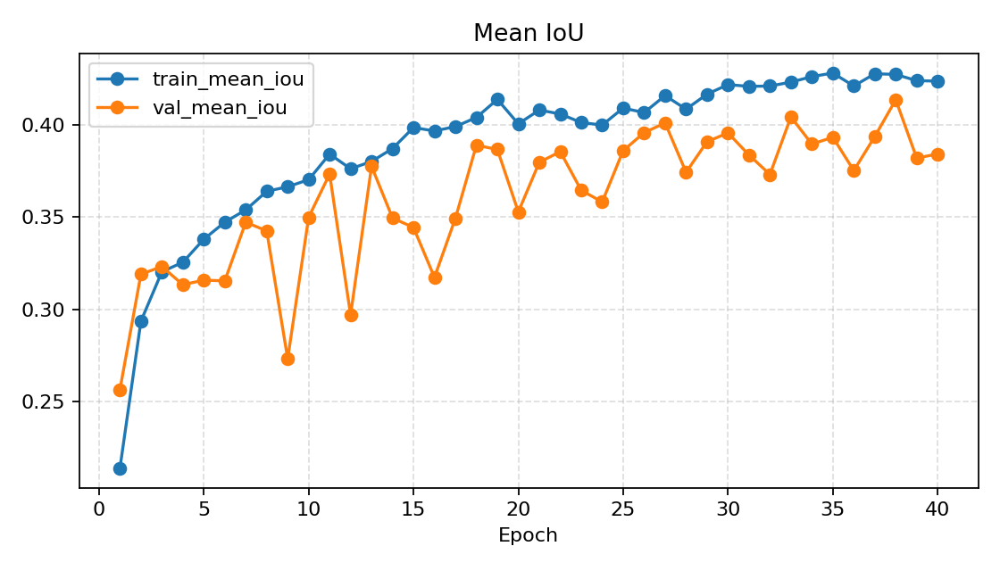

### 5.3 Cross-Entropy + Dice Loss

Loss 曲线：

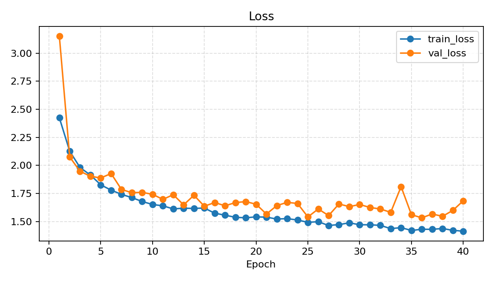

Accuracy 曲线：

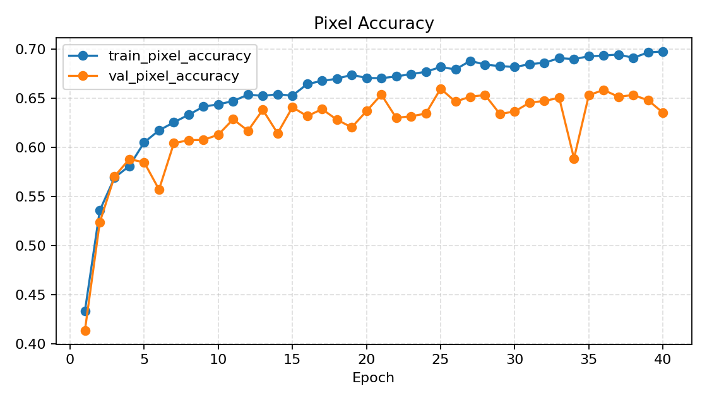

mIoU 曲线：

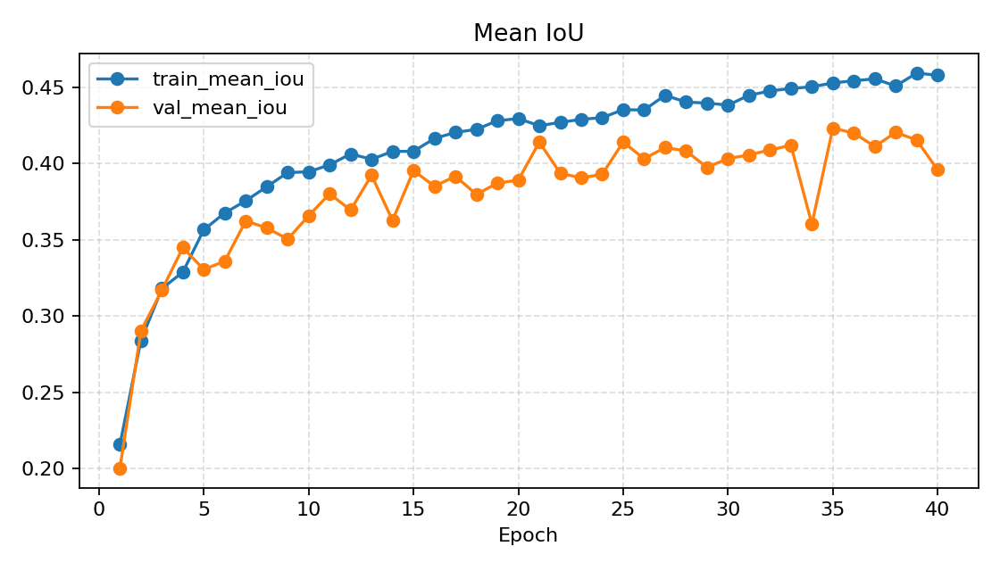

## 6. 实验结果

### 6.1 验证集最佳结果

| 实验        | 最佳 epoch | 验证集 Pixel Accuracy | 验证集 mIoU |
| --------- | --------:| ------------------:| --------:|
| CE        | 35       | 0.6652             | 0.4220   |
| Dice      | 38       | 0.6342             | 0.4136   |
| CE + Dice | 35       | 0.6531             | 0.4232   |

验证集上，`CE + Dice` 的 mIoU 最高，为 `0.4232`，但只比单独使用 CE 的 `0.4220` 略高。Dice Loss 单独训练的 mIoU 为 `0.4136`，低于另外两组。

### 6.2 测试集结果

| 实验        | 测试集 Pixel Accuracy | 测试集 mIoU |
| --------- | ------------------:| --------:|
| CE        | 0.6545             | 0.4187   |
| Dice      | 0.6174             | 0.4022   |
| CE + Dice | 0.6403             | 0.4150   |

测试集上，CE 的 mIoU 最高，为 `0.4187`；`CE + Dice` 的 mIoU 为 `0.4150`，与 CE 非常接近；Dice Loss 单独训练仍然最低，为 `0.4022`。

### 6.3 各类别 IoU 对比

| 类别                | CE     | Dice   | CE + Dice |
| ----------------- | ------:| ------:| ---------:|
| sky               | 0.6719 | 0.6580 | 0.6684    |
| tree              | 0.4096 | 0.3792 | 0.3935    |
| road              | 0.5664 | 0.5244 | 0.5705    |
| grass             | 0.5757 | 0.5272 | 0.5621    |
| water             | 0.2044 | 0.1686 | 0.2057    |
| building          | 0.5091 | 0.4925 | 0.5014    |
| mountain          | 0.0016 | 0.0959 | 0.0375    |
| foreground_object | 0.4113 | 0.3716 | 0.3808    |

从类别结果看，`sky`、`road`、`grass`、`building` 等较常见或边界较清晰的类别表现较好；`mountain` 和 `water` 的 IoU 较低，说明这些类别可能受到样本数量、外观变化或类别边界模糊的影响。

## 7. 测试集预测可视化

每组实验保存 8 张测试集预测图，图片中包含原图、真实标签和预测结果。

CE 示例：

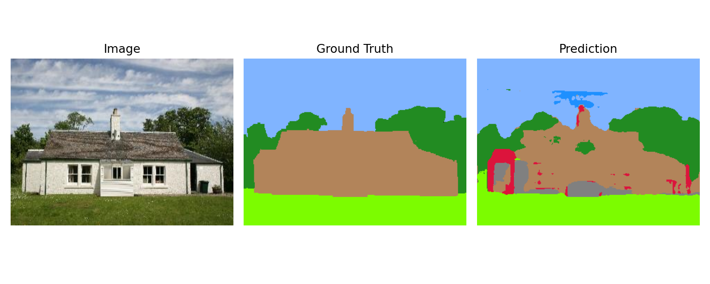

Dice 示例：

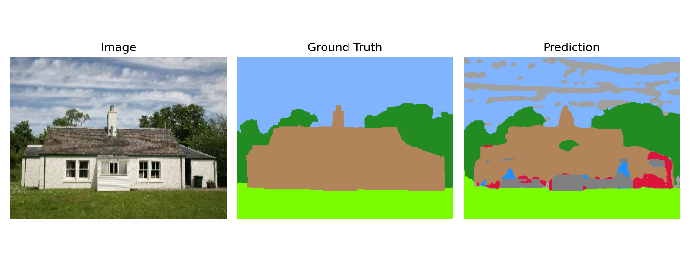

CE + Dice 示例：

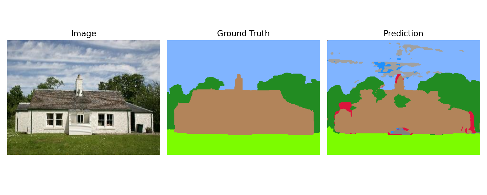

## 8. 结果分析

从训练曲线看，三组实验的训练 loss 均整体下降，说明模型能够正常学习数据分布。验证集 mIoU 和 Accuracy 随训练推进逐步提升，后期存在一定波动，说明模型在小规模语义分割数据集上可能受验证集样本分布影响较明显。

从验证集结果看，`CE + Dice` 的最佳 mIoU 略高，说明组合损失可以在像素分类稳定性和区域重叠优化之间取得一定平衡。但在测试集上，CE 的 mIoU 和 Pixel Accuracy 均最高，说明单独使用 Cross-Entropy 在本实验设置下泛化表现更稳定。

Dice Loss 理论上有助于缓解类别不均衡，但本实验中单独使用 Dice Loss 的效果不如 CE。这可能是因为 Dice Loss 对训练初期预测分布较敏感，且 Stanford Background Dataset 中部分类别边界复杂、类别外观变化大，单独优化区域重叠指标不一定能带来更好的像素级分类稳定性。

## 9. 结论

本实验完成了基于 Stanford Background Dataset 的 U-Net 语义分割训练、评估和可视化流程。三组损失函数实验均成功训练 40 个 epoch，并生成最佳模型权重、测试指标、预测可视化和实验报告。

主要结论如下：

- U-Net 能够在 Stanford Background Dataset 上完成有效的像素级语义分割。
- 验证集上 `CE + Dice` 的 mIoU 最高，但与 CE 差距很小。
- 测试集上 CE 的 mIoU 和 Pixel Accuracy 最高，综合表现最好。
- Dice Loss 单独训练在本实验中表现相对较弱。
- 部分类别如 `mountain`、`water` 的 IoU 较低，后续可考虑类别重加权、数据增强或更强的编码器结构进一步改进。

## 10. 产物清单

代码：

```text
src/
scripts/
configs/
tests/
```

模型权重：

```text
checkpoints/unet_ce_best.pt
checkpoints/unet_dice_best.pt
checkpoints/unet_ce_dice_best.pt
```

训练和测试结果：

```text
runs/unet_ce/
runs/unet_dice/
runs/unet_ce_dice/
```

报告：

```text
reports/experiment_report.pdf
reports/experiment_report.md
```
